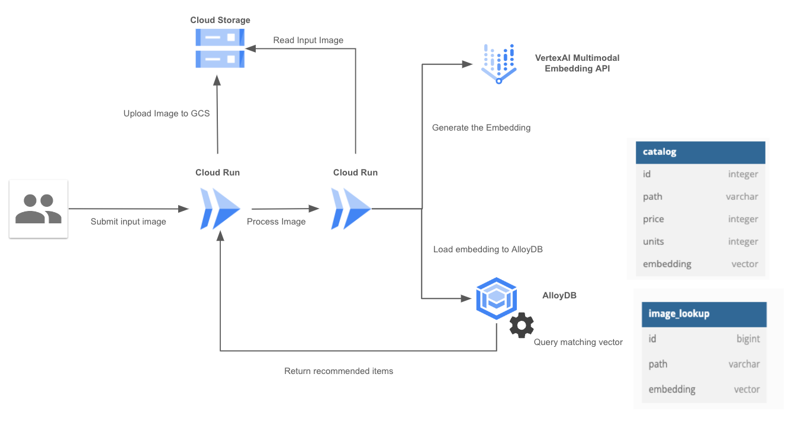

# GenAI Fashion Item Recommendation

Note: This project is for demonstration only and is not an officially supported Google product.

## Introduction

This project demonstrates how we can provide our application with advanced search capabilities based on techniques such as embeddings and vector searches to improve the user experience.

The demo shows the search module of an online fashion store. The search engine is able to recommend items from our catalog based on an image provided.

Specifically, the demo showcases the following:

- **Image embedding**: The system extracts a vector representation (embedding) from the uploaded image.
- **Vector search**: The system compares the extracted embedding to a database of embeddings of known items in the catalog.
- **Recommendation**: The system recommends items that are similar to the uploaded image based on the results of the vector search.

## Table of Contents
<!-- TOC depthfrom:2 -->

- [Introduction](#introduction)
- [Table of Contents](#table-of-contents)
- [Understanding the demo](#understanding-the-demo)
    - [Understanding Retrieval Augmented Generation RAG](#understanding-retrieval-augmented-generation-rag)
    - [Using ReACT + RAG together](#using-react--rag-together)
    - [Architecture](#architecture)
- [Deploying](#deploying)
    - [Before you begin](#before-you-begin)
    - [Setting up your Database](#setting-up-your-database)
    - [Deploying the Recommendation Service](#deploying-the-recomendation-service)
    - [Running the Recommendation Service](#running-the-recommendation-service)
    - [Clean up Resources](#clean-up-resources)
- [Writing your own retrieval service](#writing-your-own-retrieval-service)

<!-- /TOC -->

## Understanding the demo
### Architecture

The diagram show the architecture of the demo



## Deploying

Deploying this demo consists of 3 steps:

1. creating your database and initializing it with data
2. Deploying your service -- deploying your recommendation service and connecting it to your database
3. Running the Recommendation

### Before you begin
Clone this repo to your local machine:
```
git clone https://github.com/mtoscano84/genai-fashionmatch.git
```

### Setting up your Database
The recommendation service uses a database to store the image embeddings and perform similarity searches to generate recommendations based on the catalog.

Follow these instructions to set up and configure the database

[Setting up your Database](docs/alloydb.md)

### Deploying the Recommendation Service
The Recommendation service is based on two Cloud Run services:

1. **Frontend**: Manages the user interface and orchestrates the calls needed to process requests and display the recommended items.
2. **Backend**: Orchestrates the generation of the embedding from the image provided by the user, its insertion into the database, and the similarity search to obtain the catalog items.

To deploy the recommendation service, follow these instructions:

[Deploy the Recommendation Service](docs/deploy_recommendation_service.md)

### Running the Recommendation Service
Instructions for running app locally

### Clean up Resources
[Instructions for cleaning up resources](./docs/clean_up.md)

## Writing your own Recommendation Service


