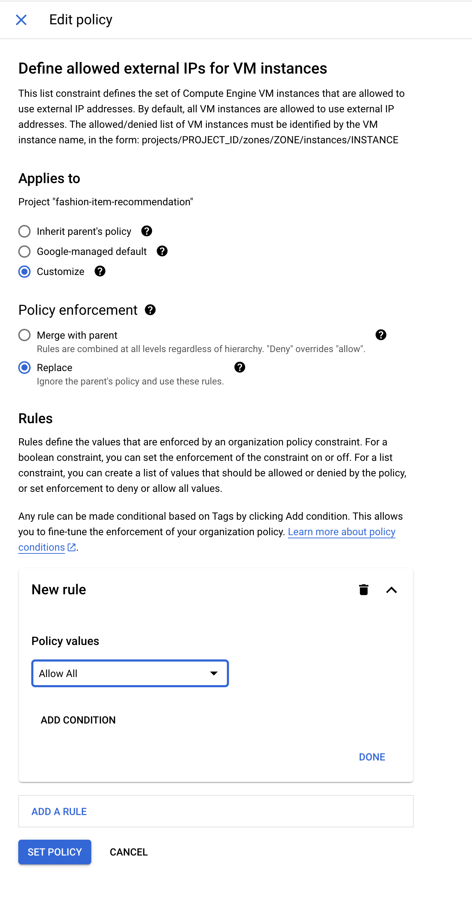
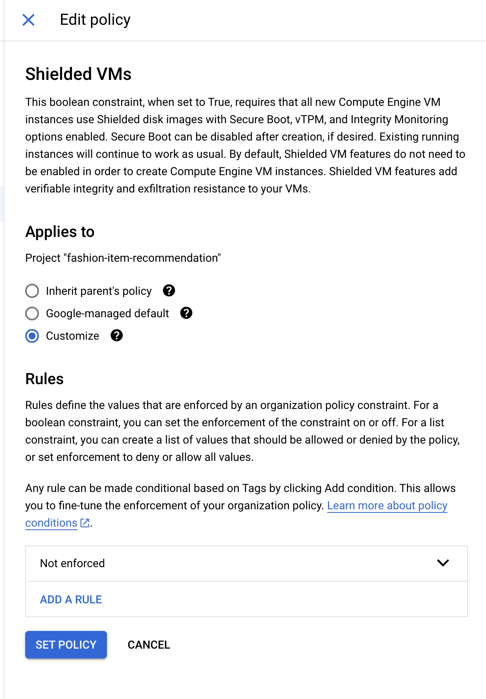

# Setup and configure AlloyDB
## Before you begin

1. Make sure you have a Google Cloud project and billing is enabled.

2. Set your PROJECT_ID environment variable:
```
export PROJECT_ID=<YOUR_PROJECT_ID>
```

3. [Install](https://cloud.google.com/sdk/docs/install) the gcloud CLI.

4. Set gcloud project:
```
gcloud config set project $PROJECT_ID
```
5. Enable APIs:
```
gcloud services enable alloydb.googleapis.com \
                       compute.googleapis.com \
                       cloudresourcemanager.googleapis.com \
                       servicenetworking.googleapis.com \
                       vpcaccess.googleapis.com \
                       aiplatform.googleapis.com
```

6. Install [python](https://cloud.google.com/python/docs/setup#installing_python) and set up a python virtual environment.

7. Make sure you have python version 3.11+ installed.

```
python3 -V
```

8. Download and install [postgres-client cli (psql)](https://www.timescale.com/blog/how-to-install-psql-on-mac-ubuntu-debian-windows/)

## Enable private services access
In this step, we will enable Private Services Access so that AlloyDB is able to connect to your VPC. You should only need to do this once per VPC (per project).

1. Set environment variables:
```
export VPC_NAME=my-vpc
export SUBNET_NAME=my-subnet
export RANGE_NAME=my-allocated-range-default
export DESCRIPTION="peering range for alloydb-service"
```
2- Create VPC Network and subnet:
```
gcloud compute networks create $VPC_NAME \
    --project=$PROJECT_ID \
    --subnet-mode=custom \
    --mtu=1460 \
    --bgp-routing-mode=regional
```
3- Create a subnet:
```
gcloud compute networks subnets create $SUBNET_NAME \
    --project=$PROJECT_ID \
    --range=10.0.0.0/24 \
    --stack-type=IPV4_ONLY \
    --network=$VPC_NAME \
    --region=us-central1
```
4- Create a Firewall rule to allow SSH to the Network:
```
gcloud compute firewall-rules create allow-ssh-$VPC_NAME --network $VPC_NAME --allow tcp:22,tcp:3389,icmp --source-ranges 0.0.0.0/0
```

5. Create an allocated IP address range:
```
gcloud compute addresses create $RANGE_NAME \
    --global \
    --purpose=VPC_PEERING \
    --prefix-length=16 \
    --description="$DESCRIPTION" \
    --network=$VPC_NAME
```

6. Create a private connection:
```
gcloud services vpc-peerings connect \
    --service=servicenetworking.googleapis.com \
    --ranges="$RANGE_NAME" \
    --network=$VPC_NAME
```

## Create a AlloyDB cluster
1. Set environment variables. For security reasons, use a different password for $DB_PASS and note it for future use:
```
export CLUSTER=my-alloydb-cluster
export DB_PASS=my-alloydb-pass
export INSTANCE=my-alloydb-instance
export REGION=us-central1
```

2. Create an AlloyDB cluster:
```
gcloud alloydb clusters create $CLUSTER \
    --password=$DB_PASS\
    --network=$VPC_NAME \
    --region=$REGION \
    --project=$PROJECT_ID
```

3. Create a primary instance:
```
gcloud alloydb instances create $INSTANCE \
    --instance-type=PRIMARY \
    --cpu-count=4 \
    --region=$REGION \
    --cluster=$CLUSTER \
    --project=$PROJECT_ID \
    --ssl-mode=ALLOW_UNENCRYPTED_AND_ENCRYPTED
```

4. Get AlloyDB IP address:
```
export ALLOYDB_IP=$(gcloud alloydb instances describe $INSTANCE \
    --cluster=$CLUSTER \
    --region=$REGION \
    --format 'value(ipAddress)')
```
5. Note the AlloyDB IP address for later use:
```
echo $ALLOYDB_IP
```

### Set up connection to AlloyDB
AlloyDB supports network connectivity through private, internal IP addresses only. For this section, we will create a Google Cloud Engine VM in the same VPC as the AlloyDB cluster. We can use this VM to connect to our AlloyDB cluster using Private IP.

1. Set environment variables:
```
export ZONE=us-central1-a
export VM_INSTANCE=alloydb-proxy-vm
```

2. Disable the following Organization Policies using the console:

Set **compute.vmExternalIpAcces** to **Allow**



Set **constraints/compute.requireShieldedVm** to **Not Enforced**



3. Assign the necessary roles to the default Compute Engine Service Account:

Get your project number to build the default service account name in the format "$PROJECT_NUM-compute@developer.gserviceaccount.com"
```
gcloud projects describe $PROJECT_ID --format="value(projectNumber)"
```

```
gcloud projects add-iam-policy-binding $PROJECT_ID \
    --member='serviceAccount:$PROJECT_NUM-compute@developer.gserviceaccount.com' \
    --role='roles/alloydb.client'

gcloud projects add-iam-policy-binding $PROJECT_ID \
     --member='serviceAccount:$PROJECT_NUM-compute@developer.gserviceaccount.com' \
     --role='roles/serviceusage.serviceUsageConsumer'

```  

4. Create a Compute Engine VM:
```
gcloud compute instances create $VM_INSTANCE \
    --project=$PROJECT_ID \
    --zone=$ZONE \
    --machine-type=e2-medium \
    --network-interface=network-tier=PREMIUM,stack-type=IPV4_ONLY,subnet=$SUBNET_NAME \
    --maintenance-policy=MIGRATE \
    --provisioning-model=STANDARD \
    --service-account=$PROJECT_NUM-compute@developer.gserviceaccount.com \
    --scopes=https://www.googleapis.com/auth/cloud-platform \
    --create-disk=auto-delete=yes,boot=yes,device-name=$VM_INSTANCE,image-family=ubuntu-2004-lts,image-project=ubuntu-os-cloud,mode=rw,size=10,type=projects/$PROJECT_ID/zones/$ZONE/diskTypes/pd-balanced \
    --no-shielded-secure-boot \
    --shielded-vtpm \
    --shielded-integrity-monitoring \
    --labels=goog-ec-src=vm_add-gcloud \
    --reservation-affinity=any
```
5. Open a new terminal, connect to the VM Instance and install AlloyDB Auth Proxy:

Connect to the VM Instance:
```
export PROJECT_ID=genai-fashionmatch
export ZONE=us-central1-a
export VM_INSTANCE=alloydb-proxy-vm
gcloud compute ssh --project=$PROJECT_ID --zone=$ZONE $VM_INSTANCE
```
Install AlloyDB Auth Proxy
```
wget https://storage.googleapis.com/alloydb-auth-proxy/v1.7.1/alloydb-auth-proxy.linux.amd64 -O alloydb-auth-proxy
chmod +x alloydb-auth-proxy
```
6. Run the AlloyDB Auth Proxy, having it listen on its default address of 127.0.0.1:
```
export CLUSTER=my-alloydb-cluster
export INSTANCE=my-alloydb-instance
export REGION=us-central1
export PROJECT_ID=genai-fashionmatch
./alloydb-auth-proxy \
  /projects/$PROJECT_ID/locations/$REGION/clusters/$CLUSTER/instances/$INSTANCE
```
You will need to allow this command to run while you are connecting to AlloyDB. You may wish to open a new terminal to connect with.

7. Open a new terminal and set up port forwarding between your external client and the intermediary VM using SSH through IAP. This will listen to 127.0.0.1:5432 and forward through the GCE VM to your AlloyDB instance:
```
export ZONE=us-central1-a
export VM_INSTANCE=alloydb-proxy-vm
gcloud compute ssh $VM_INSTANCE \
       --tunnel-through-iap \
       --zone=$ZONE \
       --ssh-flag="-L 5432:localhost:5432"
```
You will need to allow this command to run while you are connecting to AlloyDB. You may wish to open a new terminal to connect with.

8. Verify you can connect to your instance with the psql tool. Enter password for AlloyDB ($DB_PASS environment variable set above) when prompted:
```
psql -h 127.0.0.1 -U postgres
```
9. While connected using psql, create a database and switch to it:
```
CREATE DATABASE fashionstore;
\c fashionstore
```

10. Install pgvector extension in the database:
```
CREATE EXTENSION vector;
```

11. Exit from psql:
```
exit
```

## Initialize data in AlloyDB

1. Set environment variables:
```
export PROJECT_ID=genai-fashionmatch
export REGION=us-central1
export BUCKET_NAME=catalog-repo-$PROJECT_NUM
```

2. Create a GCS Bucket
```
gcloud storage buckets create gs://$BUCKET_NAME --project=$PROJECT_ID --location=$REGION
```

3. Change into the Catalog Image Repository
```
cd genai-fashionmatch/data/catalog_images
```

4. Upload the catalog images from local to the GCS Bucket
```
gcloud storage cp * gs://$BUCKET_NAME --project=$PROJECT_ID
```

5. Make a copy of example-config.ini and name it config.ini
```
cd genai-fashionmatch/fashionmatch-service/setup
cp example-config.ini config.ini
```

6. Update config.ini with your own project, repo names and database information. Keep using 127.0.0.1 as the datastore host IP address for port forwarding.
```
;This module defines data access variables
[CORE]
PROJECT = genai-fashionmatch
LOCATION = us-central1
LANDING_REPO = landing-image-repo-863363744101
CATALOG_REPO = catalog-repo-863363744101

[CONNECTION]
host = 127.0.0.1
port = 5432
database = fashionstore
user = postgres
password = "my-alloydb-pass"
```

7. Install requirements and populate data into database:
```
source load_db.sh
```

8. Upload the architecture to GCS:
```
cd genai-fashionmatch/images
gcloud storage cp fashion_item_recommendation_app.png gs://$BUCKET_NAME --project=$PROJECT_ID
```

## Clean up resources
Clean up after completing the demo.

1. Set environment variables:
```
export VM_INSTANCE=alloydb-proxy-vm
export CLUSTER=my-alloydb-cluster
export REGION=us-central1
export RANGE_NAME=my-allocated-range-default
```

2. Delete Compute Engine VM:
```
gcloud compute instances delete $VM_INSTANCE
```

3. Delete AlloyDB cluster that contains instances:
```
gcloud alloydb clusters delete $CLUSTER \
    --force \
    --region=$REGION \
    --project=$PROJECT_ID
```

4. Delete an allocated IP address range:
```
gcloud compute addresses delete $RANGE_NAME \
    --global
```

