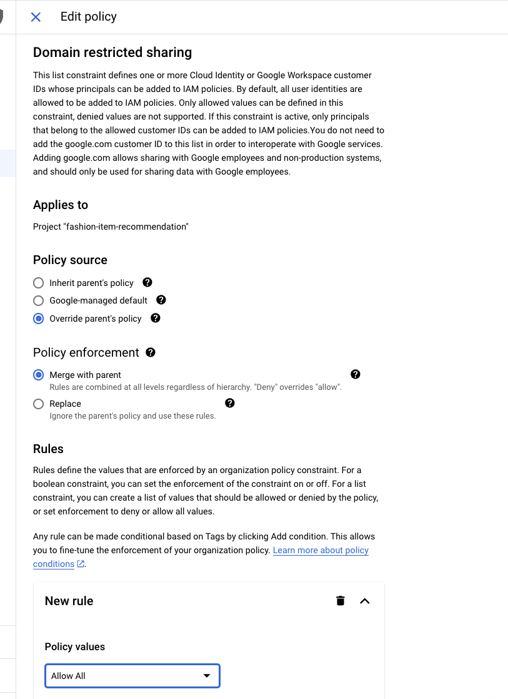

# Deploy the Recommendation Service to CloudRun

## Before you begin
1. Open a terminal and set the following environment variables
```
export REGION='us-central1'
export PROJECT_ID='genai-fashionmatch'
```

2. Enable the following APIs:
```
gcloud services enable artifactregistry.googleapis.com \
                       cloudbuild.googleapis.com \
                       run.googleapis.com
```

3. Grant the necessary permissions:

- Get your project number to build the default service account name in the format PROJECT_NUM-compute@developer.gserviceaccount.com
```
gcloud projects describe $PROJECT_ID --format="value(projectNumber)"
```

- Permissions to Read GCS files
```
gcloud projects add-iam-policy-binding $PROJECT_ID \
    --member='serviceAccount:697181134976-compute@developer.gserviceaccount.com' \
    --role='roles/storage.objectUser'
```

- Permissions to Use VertexAI to generate embedding
```
gcloud projects add-iam-policy-binding $PROJECT_ID \
    --member='serviceAccount:697181134976-compute@developer.gserviceaccount.com' \
    --role='roles/aiplatform.user'
```

4. If you are under a domain restriction organization policy [restricting](https://cloud.google.com/run/docs/authenticating/public#domain-restricted-sharing) unauthenticated invocations for your project (e.g. Argolis), you will need to temporary disable de Org Policy **iam.allowedPolicyMemberDomains**



**Note**: The organization policy should be re-established after the IAM policy assigned during the CloudRun Service deployed

5. Create the GCS Bucket for the user input image:
```
export BUCKET_NAME=landing-image-repo

gcloud storage buckets create gs://$BUCKET_NAME --project=$PROJECT_ID --location=$REGION
```

## Deploy the backend service to CloudRun
1. Change to the `backend/cloudrun` directory:
```
cd fashionmatch-service/backend/cloudrun
```

2. Set the variable **host** on the [CONNECTION] section of the config.ini file to the AlloyDB Private IP

Get the AlloyDB Private IP
```
export CLUSTER=my-alloydb-cluster
export INSTANCE=my-alloydb-instance

gcloud alloydb instances describe $INSTANCE \
    --cluster=$CLUSTER \
    --region=$REGION \
    --format 'value(ipAddress)'
```

Update the config.ini file
```
;This module defines data access variables
[CORE]
PROJECT = fashion-item-recommendation
LOCATION = us-central1
LANDING_REPO = landing-image-repo01
CATALOG_REPO = catalog-repo

[CONNECTION]
host = **10.143.0.7**
port = 5432
database = fashionstore
user = postgres
password = Welcome1
```

4. Set the service_name variable and deploy the service
```
export BACKEND_SERVICE_NAME=fashionmatch-backend

source deploy_backend_to_cloudrun.sh 
```

## Deploy the frontend service to CloudRun
1. Change to the `backend/cloudrun` directory:
```
cd fashionmatch-service/frontend/cloudrun
```

2. Set the service_name variable and deploy the service
```
export FRONTEND_SERVICE_NAME=fashionmatch-app

source deploy_frontend_to_cloudrun.sh 
```

3. Open a Web Browser and navegate to the Service URL from the previous step
